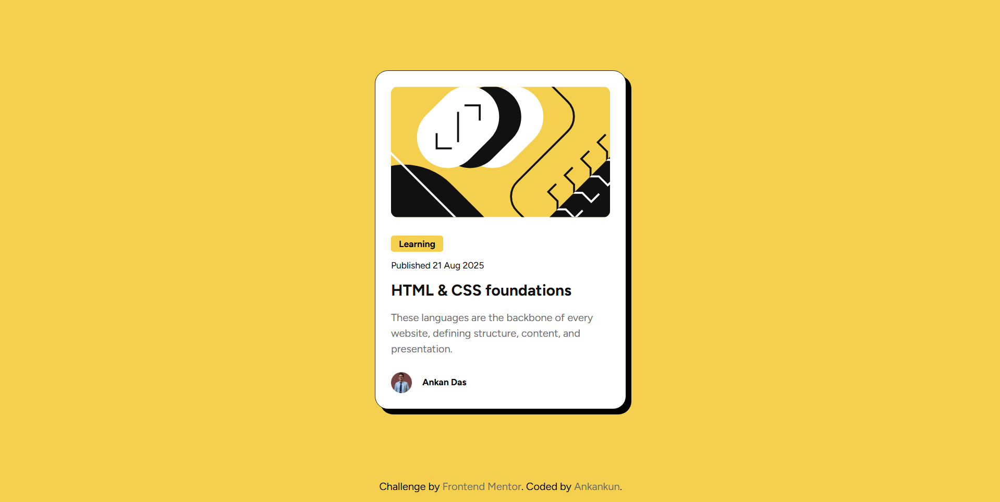

# Blog preview card 

This is my solution to the [Blog preview card challenge](https://www.frontendmentor.io/challenges/blog-preview-card-ckPaj01IcS). It’s a small, single-card UI built with semantic HTML and modern CSS, matching the provided design with hover states and clean typography.

## Table of contents

- [Overview](#overview)
  - [The challenge](#the-challenge)
  - [Links](#links)
- [My process](#my-process)
  - [Built with](#built-with)
  - [What I learned](#what-i-learned)
  - [Continued development](#continued-development)
  - [Useful resources](#useful-resources)
- [Author](#author)
- [Deployment](#deployment)

## Overview

### The challenge

Users should be able to:

- See hover and focus states for interactive elements (e.g., title link)
- View a responsive, accessible card across screen sizes

### Links

- Solution URL: https://www.frontendmentor.io/solutions/blog-preview-card-using-css-box-model-SIqEjqAYO_
  
- Live Site URL: https://ankankun.github.io/Blog-Preview-Card/

## My process

### Built with

- Semantic HTML5
- Modern CSS (shadows, border radius, hover states)
- Simple layout utilities
- Responsive, fluid sizing for media and typography

### What I learned

- Centering a fixed-width card cleanly while keeping inner content left-aligned (parent text-align vs. layout centering).
- Managing inline vs. flex layouts for small UI bits (e.g., avatar + name), and when to switch to flex for simpler vertical alignment and spacing.
- Keeping images crisp and contained with `max-width: 100%`, fixed avatar sizing, and `border-radius`.
- Deploying static sites to GitHub Pages from the `main` branch with relative asset paths.

### Continued development

- Introduce CSS variables for colors, spacing, and shadows.
- Tighten accessibility (focus outlines, color contrast, semantics).
- Expand states/animations for hover/focus while respecting reduced motion.

### Useful resources

- MDN: [text-align](https://developer.mozilla.org/en-US/docs/Web/CSS/text-align)
- MDN: [Flexbox](https://developer.mozilla.org/en-US/docs/Web/CSS/flex)
- GitHub Docs: [GitHub Pages basics](https://docs.github.com/en/pages/getting-started-with-github-pages)

## Author

- GitHub: [@Ankankun](https://github.com/Ankankun)
- Frontend Mentor: [@Ankankun](https://www.frontendmentor.io/profile/Ankankun)
